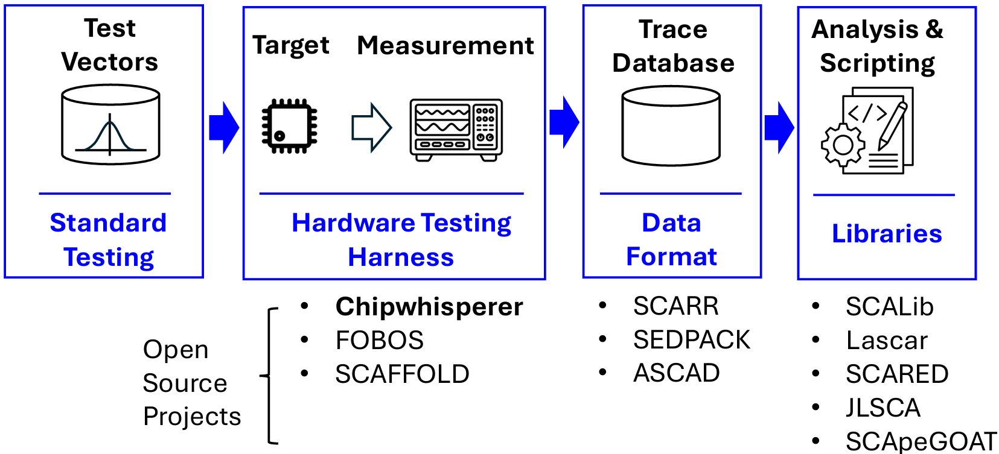

# An Open Source Ecosystem for Implementation Security Testing

Implementation-security vulnerabilities such as the power-based side-channel leakage and fault-injection sensitivity of a secure chip are hard to verify because of the sophistication of the measurement setup, as well as the need to generalize the adversary into a test procedure. While the literature has proposed a wide range of vulnerability metrics to test the correctness of a secure implementation, it is still up to the subject-matter expert to map these concepts into a working and reliable test procedure. Recently, we investigated the benefits of using anopen-source implementation security testing environment called Chipwhisperer. The open-source and low-cost nature of the Chipwhisperer hardware and software has resulted in the adoption of thousands of testing kits throughout academia and industry, turning the testkit into a baseline for implementation security testing. We investigate the use cases for the Chipwhisperer hardware and software, and we evaluate the feasibility of an open-source ecosystem for implementation security testing. In addition to the open-source hardware and firmware, an ecosystem also considers broader community benefits such as re-usability, sustainability, and governance. 
<!-- truncate -->

## I. Introduction

When a secure asset is integrated into the hardware or firmware of a chip, testing its claimed security level is mandatory. It is now well understood that the classic blackbox model, which assumes that the secure asset can be realized in a perfectly isolated and protected enclosure, is not realistic. A broad range of threat mechanisms, including sidechannel attacks and fault injection, can leverage a wide range of implementation properties of the secure asset, including power consumption, electromagnetic emissions, and optical emissions, among others. Surprisingly, while implementation security liabilities have been extensively researched over the past three decades, standard testing and certification methods are still being established [1].

Currently, the industry best practice is to use an external testing lab, which will apply a reference such as FIPS 1403, Common Criteria (CC) or NSS NIAP. However, these standards do not specify the test procedures. In the case of non-invasive attack techniques (e.g., power-based side-channel leakage), some progress has been made. Attacker-dependent metrics, such as measurements-to-disclosure for a secret key, are now replaced by trace-statistics metrics using Test Vector Leakage Assessment (TVLA). This metric does not confirm that an attack exists but highlights that some information leaks. A recent ISO standard, ISO 17825, aims at formalizing this test for a generic set ofCritical Security Parameters. For fault attacks, no convergence on testing procedures has been achieved yet.


*Figure 1: Standard layout of a side-channel test setup, with opportunities for open interfaces, libraries, and components.*


We observe that convergence in security testing can be accelerated by an open-source ecosystem. Figure 1 illustrates a standard layout of a side-channel test setup, and in blue, the opportunities for standard open interfaces, libraries as well as components that can accelerate the test construction. The Chipwhisperer project is currently best known for supporting this standardized setup, especially thanks to low-cost hardware to support a hardware testing harness [2]. However, it is not the only one, and Figure 1 illustrates several additional open-source projects that address at least part of the tasks in a side-channel analysis campaign. In the next few sections, we justify the benefits of using Open Source to support implementation security testing, and we report our initial findings on a series of interviews we completed within the ChipWhisperer community.


## II. Justifying Open Source Implementation Security Testing

The Department of Defense (DoD) can significantly benefit from the transparency offered by open-source implementations, particularly in the context of security testing and assurance. Open-source hardware and software allow for peer review and community scrutiny, which can lead to the early identification and resolution of problematic cases. This transparency fosters a higher level of trust, as all stakeholders– including DoD–can independently verify the claims made by developers. Additionally, the open nature of the code facilitates ```  the integration of advanced techniques such as formal verification methods and rigorous security audits, thereby ensuring that the software meets the stringent requirements necessary for high-assurance systems. 
 
Open-source implementations also offer increased reusability and customization, which are crucial for DoD projects that often have unique and evolving requirements. By leveraging open-source components, the DoD can build upon existing, well-tested codebases, reducing development time and costs. This reuse not only speeds up the deployment of new systems but also enhances their reliability, as the underlying open-source components are typically well-maintained by a broad community. Furthermore, open source still allows the DoD to leverage its advanced capabilities, allowing the DoD to customize it through propriety implementations for meeting specific mission needs or advanced offensive capabilities. Therefore, embracing open-source does not equate to a loss of competitive advantage or security posture. Open-source thus should be viewed as a strategic asset that complements, rather than diminishes, the DoD's existing security infrastructure. 
 
Open source also plays a crucial role in workforce development, an area where the DoD stands to gain significantly. By encouraging the use of open-source tools and platforms, the DoD can accelerate the cultivation of a workforce that is skilled in the latest technologies and security practices. Open-source projects provide an excellent training ground for developers and security professionals, offering real-world experience in handling complex security challenges. 

## III. Outcome of Interviews

As part of a feasibility study on Chipwhisperer, we have conducted 72 interviews over video and 4 over email communication to solicit feedback from the community. Figure 2 shows the distribution of the interviewees across geography and professional associations. 


*Figure 2: Geographical and professional distribution of the 76 conducted interviews.*

The common advantages of ChipWhisperer identified by the community are as follows. Widely adopted in academic education and research settings, with over 90% usage, Chipwhisperer has significantly contributed to the growth of the field. Its low cost, with no licensing fees, makes it accessible to a broad audience, while its flexible and extensible framework fosters innovation, despite recent delays in updates. Chipwhisperer's versatility supports a wide range of applications, such as sidechannel (66 mentions) and fault injection attacks (36 mentions). An active community on forums and Slack channels further enhances collaboration and knowledge sharing within the security community (37 mentions). 

While Chipwhisperer is a widely used tool, it faces several challenges that limit its broader adoption and usability. Scalability and interoperability issues are particularly evident in high-performance or large-scale environments (56 mentions), and the documentation is often inadequate for more advanced use cases and more recent devices (28 mentions). It also has a steep learning curve, especially for beginners or those attempting to use its advanced features, leaving many students confused after the initial experiment (20 mentions). Reproducibility remains a challenge (15 mentions), though no better alternative currently exists. Additionally, reliance on NewAE (the company fabricating the Chipwhisperer platforms) for community support and device production can slow its adoption (14 mentions). 

Based on the lessons learned, our envisioned ecosystem plans to achieve the following tasks.

- **Navigable Index:** A centralized, easily navigable index of existing open-source projects, datasets, and protocols to reduce the time to a working product or experiment.
- **Education:** Better teaching tools to help learners expand past the tutorial stage and build a better theoretical understanding.
- **Incentives:** A clear structure to incentivize contributions to open-source either through guidelines or rewards.
- **Interfaces:** Standardized interfaces and documentation techniques to help improve reproducibility and the adoption of new tools.
- **Better Hardware:** Identify improved capabilities of open-source hardware to help compete with closed-source hardware or make expanding capabilities easier.

# IV. Next Steps and Conclusions

We have recently started a workshop series to bring together open-source communities around standard interfaces for implementation security testing. The kickoff event (https://optimist-ose.org/ches24) was held in September '24. In the coming months, online meetings will be organized and announced through an open forum (https://optimist-ose.org). Initial discussion topics will include Trace Data Formats, Capture Interface for Side-channel leakage, and Firmware Interfaces for Target Control, with new ones to be added. In addition to the online meetings, we will develop a plan for governance and sustainability of the standard interface work in the area of implementation security testing. 

This effort was supported through the National Science Foundation *Pathways to Open Source Ecosystems* program, Award no 2346138.

## References

[1] M.-J. O. Saarinen, "Introduction to Side-channel Security for NIST PQC Standards," in NIST PQC Seminar series. NIST, April 2023, https://www.nist.gov/video/intro-side-channel-security-nistpqc-standards.

[2] C. O'Flynn and Z. Chen, "ChipWhisperer: An Open-Source Platform for Hardware Embedded Security Research," in International Workshop on Constructive Side-Channel Analysis and Secure Design. Springer, 2014,
