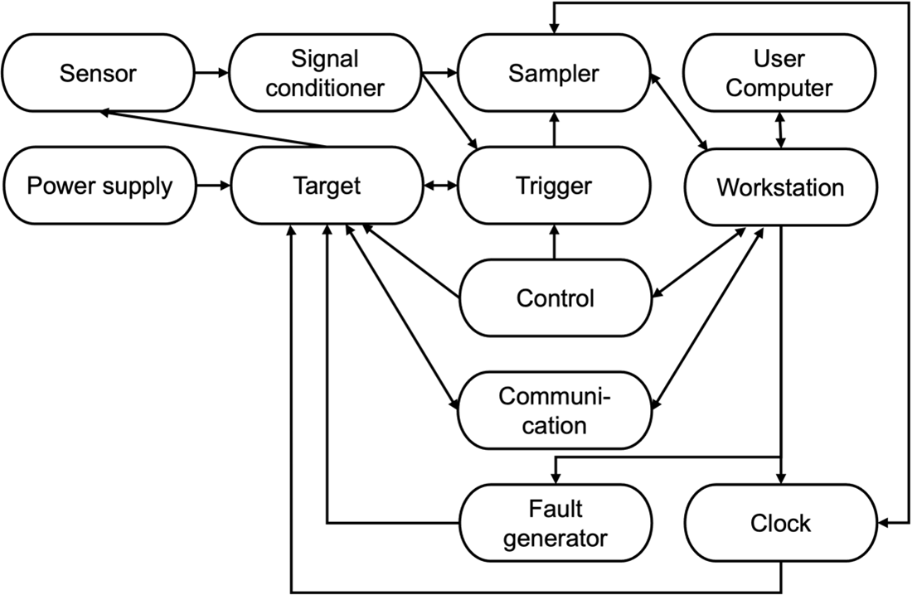

# Usual Interfaces in Practice
This section enumerates the interfaces that exist in typical side-channel and fault analysis setups. 

1.	**User Computer ↔️ Workstation**

    a.	**Purpose:** the User Computer provides a human interface to the measurement setup, including control of the workstation, and visualization and analysis of measurement data.

    b.	**Data:** session control, configuration of workstation, transfer of formatted payloads (target firmware, target bitstream, target test vectors, measured data). 

    c.	**Features:** bandwidth, latency, real-time response.

    d.	**Logical layer:** API for Session Control, API for Payload Formatting.

    e.	**Physical layer:** digital Data Transfer.

    f.	**Example:** USB, Ethernet.

2.	**Workstation ↔️ Control Board**

    a.	**Purpose:** allows sending/receiving information (e.g., configuration, state, plaintexts, ciphertexts, number of repetitions) to the Target, executing one or multiple operations with/without repeatedly sending all the inputs from the Workstation to the Target each time. In some setups, the Control Board may not be present as the Workstation is directly connected to the Target. In some instances, the communication of inputs and/or outputs can be handled for efficiency reasons by the Communication (see Interface 14) instead of the Control Board. In other cases, the Control Board can be merged with the Target.

    b.	**Data:** test vectors (e.g., inputs, expected outputs) and commands (e.g., execute a specific operation) from the Workstation to the Control Board, which are forwarded, as they are or in a different form, to the Target. The control board responds to the commands from the workstation, which may include status and outputs received by the control board from the target.

    c.	**Features:** bandwidth, latency, signaling, and communication protocols.

    d.	**Logical layer:** usually a user-defined API/protocol for control/data formatting.

    e.	**Physical layer:** digital data transfer.

    f.	**Example:** USB, UART, Ethernet. 

3.	**Workstation** ↔️ **Target** (if directly connected)

    a.	**Purpose:** configuring the target prior to measurements, controlling the operation of the target before and during measurements, resetting/restarting the target (if unresponsive), and receiving data from the target (if applicable). 

    b.	**Data:** configuration of the target (e.g., FPGA configuration file if the target is to be programmed), inputs (e.g., plaintexts on which the target cryptographic algorithm operates), operation mode (in case the target supports several operation or configuration modes, e.g., number of encryptions, frequency, enabling target operation (e.g., enabling the clock).

    c.	**Features:** bandwidth, voltage levels, signaling, and communication protocol.

    d.	**Logical layer:** file formats and corresponding drivers for communication protocols with the targets.

    e.	**Physical layer:** digital data transfer.

    f.	**Example:** USB, UART, Ethernet, PCIe. 

4.	**Sensor** ➡️ **Signal conditioner**

    a.	**Purpose:** transport of measured analog data to an analog conditioner, improving the signal. 

    b.	**Data:** analog signal.

    c.	**Features:** impedance characteristics, bandwidth

    d.	**Logical layer:** NA

    e.	**Physical layer:** analog data transfer.

    f.	**Example:** cable connections (BNC, SMA...).

5.	**Signal conditioner** ➡️ **Sampler**

    a.	**Purpose:** ADC, Analysis

    b.	**Data:** analog signal captured from the sensor 

    c.	**Features:** Filtering, DC block

    d.	**Logical layer:** NA

    e.	**Physical layer:** electrical connection.

    f.	**Example:** BNC, SMA, etc.  

6.	**Signal conditioner** ➡️ **Trigger**

    a.	**Purpose:** synchronization between target and sampler.

    b.	**Data:** soft trigger signal, e.g., generated by analysis of signal vs. explicit generation by target.

    c.	**Features:** filtering and amplifying. 

    d.	**Logical layer:** none. 

    e.	**Physical layer:** electrical connection carrying digital signal (positive edge = start trigger, negative edge = end trigger)

    f.	**Example:** the signal conditioning module of an oscilloscope being connected to the power line of the target. 

7.	**Trigger** ↔️ **Target** (unidirectional, can be **Trigger** ➡️ **Target** or **Target** ➡️ **Trigger**)
    
    a.	**Purpose:** timing synchronization between target and controller/sampler ensures alignment of traces.

    b.	**Data:** timing information signals the start of an execution.

    c.	**Features:** timing accuracy, jitter, rise time.

    d.	**Logical layer:** repeated events with accurate timing.

    e.	**Physical layer:** voltage edge over a single wire (typ. 3.3V or 5V).

    f.	**Example:** an oscilloscope’s waveform generator. 

8.	**Trigger** ➡️ **Sampler**

    a.	**Purpose:** analysis, configuration.

    b.	**Data:** signals from trigger to sampler. 

    c.	**Features:** bandwidth, speed, communication protocol, and its means. 

    d.	**Logical layer:** API for handling control, configuration, synchronization, and error handling. 

    e.	**Physical layer:** electrical connection.

    f.	**Example:** ethernet, serial, USB. 

9.	**Control ➡️ Trigger**

    a.	**Purpose:** analysis, configuration. 

    b.	**Data:** signals from trigger to sampler. 

    c.	**Features:** bandwidth, speed, communication protocol, and its means. 

    d.	**Logical layer:** API that is responsible for managing the communication, synchronization, and control between the control and trigger components. 

    e.	**Physical layer:** electrical connection.

    f.	**Example:** ethernet, serial, USB. 

10.	**Power supply ➡️ Target**

    a.	**Purpose:** powering on/off the target, force restart.

    b.	**Data:** none.

    c.	**Features:** low-noise, voltage levels.

    d.	**Logical layer:** none.

    e.	**Physical layer:** electrical connection.

    f.	**Example:** USB. 

11.	**Target ➡️ Sensor**

    a.	**Purpose:** It ensures that the sensor captures relevant signals that can be analyzed to extract sensitive information (e.g., cryptographic keys) or study vulnerabilities in the target device’s operation. 

    b.	**Data:** outputs of the target operation. 

    c.	**Features:** sampling rate, trigger conditions, and other acquisition parameters to fine-tune the data capture. 

    d.	**Logical layer:** API with commands that allow for configuring the sensor (sampling rate, trigger conditions), initiating and stopping captures, and handling the data after capture.

    e.	**Physical layer:** interface with the target device, including the physical connections, such as cables and pins. 

    f.	**Example:** an oscilloscope probe attached to power or signal lines. 

12.	**Target ↔️ Communication**

    a.	**Purpose:** target control; obtain and/or verify target result.

    b.	**Data:** inputs and outputs of the target operation (e.g., key, plaintext, ciphertext...)

    c.	**Features:** allow for different sizes

    d.	**Logical layer:** some protocol is needed (e.g., CW simple serial)

    e.	**Physical layer:** electrical connection

    f.	**Example:** UART, ethernet

13.	**Control Board ➡️ Target**

    a.	**Purpose:** Controlling the target.

    b.	**Data:** Control signal.

    c.	**Features:** timing, bit-width.

    d.	**Logical layer:** direct connections.

    e.	**Physical layer:** signal wires.

    f.	**Example:** wires.

14.	**Communication ↔️ Workstation**

    a.	**Purpose:** target control and data transfer. The communication module can be part of the components connected to one another, e.g., the control board can have an embedded communication module. 

    b.	**Data:** all necessary packets required for trigger, control/ data packets. 
    c.	**Features:** speed, bandwidth, throughput

    d.	**Logical layer:** packets format 

    e.	**Physical layer:** USB

    f.	**Example:** USB, UART, ethernet

15.	**Workstation ➡️ Fault generator**

    a.	**Purpose:** configure the fault generator.

    b.	**Data:** characteristics of the fault (e.g., for a clock glitch: offset, period, etc.); perhaps enable (or arm) and/or disable (or disarm) signal

    c.	**Features:** resolution, bandwidth, speed, communication protocol, and its means.

    d.	**Logical layer:** API that abstracts communication protocol.

    e.	**Physical layer:** electrical connection.

    f.	**Example:** ethernet, serial, USB

16.	**Workstation ↔️ Sampler**

    a.	**Purpose:** analysis, configuration. 

    b.	**Data:** configuration information going to the sampler, traces coming from the workstation.  

    c.	**Features:** resolution, bandwidth, speed, communication protocol, and its means. 

    d.	**Logical layer:** data formatted according to the API. 

    e.	**Physical layer:** digital data transfer. 

    f.	**Example:** ethernet, serial, USB. 

17.	**Workstation ➡️ Clock**

    a.	**Purpose:** configure the clock signal to be supplied by the Clock to the Target and Fault Generator.

    b.	**Data:** configuration information (e.g., frequency, amplitude, width, duty cycle, rise time, fall time) from the Workstation to the Clock, which generates the clock signal used by the Target and Fault Generator.

    c.	**Features:** bandwidth, latency, characteristics of the communication protocol/API supported by the Clock.

    d.	**Logical layer:** data formatted according to the API of the clock generator

    e.	**Physical layer:** digital data transfer.

    f.	**Example:** USB, Ethernet.

18.	**Clock ↔️ Target**

    a.	**Purpose:** provide a reference clock to the target () or get the target clock to synchronize other components ().

    b.	**Data:** analog clock signal.

    c.	**Features:** impedance characteristics, voltage levels, frequency.

    d.	**Logical layer:** None.

    e.	**Physical layer:** analog Data Transfer.

    f.	**Example:** quartz on a board (), function generator connected to the target clock input (), internal clock exposed on a GPIO ().

19.	**Clock ➡️ Sampler**

    a.	**Purpose:** synchronizing the sampler with the target.

    b.	**Data:** clock signal(s) directly or indirectly clock-related information such as frequency or phase.

    c.	**Features:** frequency, voltage levels, phase with respect to a reference.

    d.	**Logical layer:** API for clock-specific information (frequency, phase) or none.

    e.	**Physical layer:** digital signal or digital data transfer.

    f.	**Example:** high bandwidth interfaces (SMA, BNC) or digital communication interfaces (UART, USB).

*Figure 1: Interfaces in a side-channel/fault analysis setup.*
