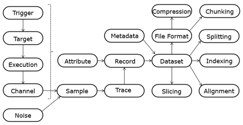

# Glossary
This section enumerates and defines common terms related to the file format for traces of side-channel leakage.

*Figure 1: Common terms and their interconnections.*

**Channel:** The source of a measurement of a physical value over time.

**Trigger:** A Channel used to synchronize measurements with specific operations in the Target.

**Target:** The object of side-channel leakage measurements.

**Execution:** The activity of a target associated with a single trigger.

**Noise (Algorithmic vs. Environment):**  Unwanted variations in measurements that can obscure the desired signal in a trace.  
    - **Algorithmic:** Variations in the measured signal caused by the internal computations or processes of the device itself. This includes inherent randomness or variations due to the algorithm's design, state transitions, or other non-target data dependencies. 
    - **Environment:** External factors that introduce variability in the measurements, unrelated to the device's internal computations. This includes interference from the measurement setup, power supply noise, electromagnetic interference, or changes in the surrounding environment such as temperature drift.

**Sample:** A single measurement of a Channel corrupted by Noise.

**Trace:**  Vector corresponding to a sequence of measurements over time of a Channel during one Execution.

**Metadata:** Metadata is used to provide context and supplementary information about trace sets, such as type of device being analyzed, cryptographic algorithm being executed, version of the algorithm implementation, sampling rate and resolution of the measurement equipment, environmental conditions during data collection, applied countermeasures, date and time of data acquisition.

**Attributes:** Attributes are named variables to store all data associated with a single execution, including the Trace. Named variables that apply to a complete dataset are Metadata.

**Record:** The values of all attributes specific for one execution.

**Dataset:** Sequence of Records with the Attributes, along with Metadata

**File Format:** A file format describes how the data is stored on a filesystem. In side-channel analysis, file formats are essential for managing, organizing, and processing large trace datasets and accompanying metadata.

**Compression:** Compression is a technique used to reduce the size of a file, which can be beneficial for storage, transmission, and computation.

**Alignment:** The process of adjusting traces to account for variations in timing or other properties.

**Slicing:** Creating a new dataset as a subset of an existing Dataset.
Record Slicing: taking a subset of the Records of the dataset.
Vector/Trace Slicing: taking a subset of the indices in the Vector associated to a Variable.

**Indexing:** Selecting a specific record, attribute and/or trace based on their position in the set, leading to Record Index, Attribute Index and Trace Index.
	- **Fancy Indexing:** Indexing by means of an array or list of indices, allowing for
 	non-contiguous or non-sequential selection of elements.
	- **Contiguous Indexing:** Indexing corresponding to an integer interval of indices.

**Splitting:** Partitioning the records of a dataset for a specific purpose, such as for machine learning experiments. 
	- **Training Split:** A partition of records used for model training.
	- **Validating Split:** A partition of records used for model validation.
	- **Testing Split:** An exclusive partition of records used for model testing.

**Chunking:** Structuring the File Format to optimize for specific access patterns and to align with compression, such that a selection of the data only requires decompression of selected chunks, as opposed to the whole data set.
